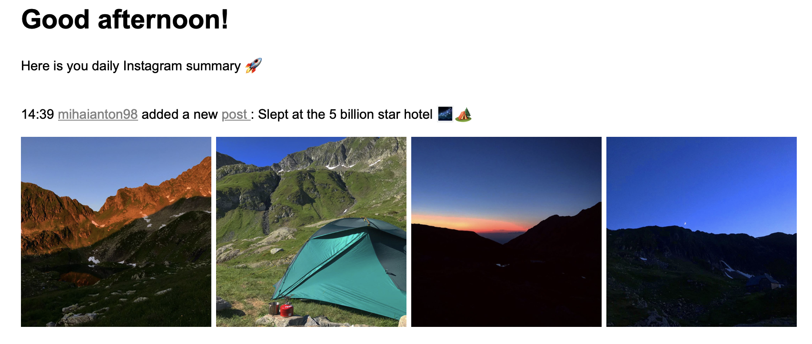

# InstaFeed

Stop wasting time scrolling Instagram. Get all the updates you want once a day in your email inbox.

## Built using

- Selenium
- Django
- Chrome Driver

## How to use

1. Get a VM. I used Digital Ocean, but any cloud provider should work.
2. Ssh into the vm, install git, docker, docker-compose.
3. Clone the project: `git clone git@github.com:MihaiAnton/InstaFeed.git`
4. Cd into it: `cd InstaFeed`
5. Change the mail recipients [here](https://github.com/MihaiAnton/InstaFeed/blob/28729d32c91db128e66c0c4423b51d60cd5ce82c/instagramscraper/tasks.py#L222).
6. Create a `.env` file. Make sure it has:
    - INSTAGRAM_USERNAME=< your Instagram username >
    - INSTAGRAM_PASSWORD=< your Instagram password>
    - SECRET_KEY=< your Django secret key >
    - EMAIL_ACCOUNT=< your gmail account >
    - EMAIL_USER=< the password fot the gmail account >

7. Build: `docker-compose build`
8. Run: `docker-compose up`
    - At this moment, the server scrapes once every 4 hours and sends the email at 7PM CET. You can modify these [here](https://github.com/MihaiAnton/InstaFeed/blob/28729d32c91db128e66c0c4423b51d60cd5ce82c/instafeed/settings.py#L167) and [here](https://github.com/MihaiAnton/InstaFeed/blob/28729d32c91db128e66c0c4423b51d60cd5ce82c/instafeed/settings.py#L172).

9. Create a superuser (I will automate this soon)
    - ssh into your VM again and enter the project directory
    - run `docker-compose run web-wsgi bash`
    - run `python manage.py createsuperuser`
    - follow the instructions

10. Go to `YOUR_IP:8004/admin` and add Instgram usernames.
    - If you are able to see their profile normally through Instagram, you will get updates once they add a new post.